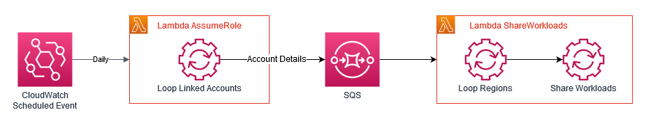

# Multi-region, multi-account Well-Architected Review sharing

This article describes how to set up automated sharing of all [Well-Architected reviews](https://aws.amazon.com/architecture/well-architected) from all regions in all accounts in a single [AWS Organization](https://aws.amazon.com/organizations/) to a specified AWS account. This is useful if you have a central team within your organization that is involved in all AWS Well-Architected reviews and wish to simplify their access to these reviews.

This solution automates the [sharing capability](https://docs.aws.amazon.com/wellarchitected/latest/userguide/workloads-sharing.html) that the Well-Architected Tool provides. Before we go any further we should define some important terms that will be used so that we can avoid confusion:

- ## Management Account

  This is the root account of your AWS Organization also sometimes referred to as the *Payer Account*.

- ## Member Account

  These are all the other accounts in your AWS Organization. i.e. Any account that is not the Management Account. They are also sometimes referred to as *Linked Accounts*.

- ## Automation Account

  This a [Member Account](#member-account) that has nominated to carry out the automation tasks in this solution.

  *Whilst it is possible to use the [Management Account](#management-account) for this, it is considered best practice to use a dedicated account instead of the [Management Account](#management-account).*

- ## Reviews Account

  This is an account that will receive the Well-Architected Workload shares. It can be a [Member Account](#member-account) or it can be any other AWS Account, even one that is a [Member Account](#member-account) in another AWS Organization.

The below diagram shows the high-level logic for this solution. The [Automation Account](#automation-account) will contain a [Amazon CloudWatch](https://docs.aws.amazon.com/cloudwatch) Scheduled Event. This Scheduled Event will trigger once a day and at that time it will loop through all [Member Accounts](#member-account) in the AWS Organization. For each [Member Account](#member-account) it will then loop through all supported AWS Regions for the [AWS Well-Architected Tool](https://docs.aws.amazon.com/wellarchitected) in each region it will search for any Well-Architected Workloads that have not already been shared with the [Reviews Account](#reviews-account) and create a share for them.

In order to give scalability and resiliency to this solution we will be using 2 [AWS Lambda](https://aws.amazon.com/lambda/) functions. The first will be triggered by the Scheduled Event and perform the loop on the [Member Accounts](#member-account) and populate an [AWS SQS](https://aws.amazon.com/sqs/) queue with temporary access credentials for each [Member Account](#member-account). The second Lambda Function will be triggered by the SQS queue and will use the temporary credentials to loop all supported regions and share the Well-Architected Workload with the [Reviews Account](#reviews-account).



## Pre-requisites

1. All the AWS accounts need to exist in advance.
2. The [Automation Account](#automation-account) needs to have the ability to list all the [Member Accounts](#member-account) using the `ListAccounts` AWS API call, this operation can be called only from the organization’s [Management Account](#management-account) or by a [Member Account](#member-account) that is a [delegated administrator](https://docs.aws.amazon.com/organizations/latest/userguide/orgs_integrate_services_list.html) for an AWS service. In this article we are using an account that has been delegated administrator for the `AWS Audit Manager` service, however you can use any service you wish or may already have delegated.
3. An IAM role in every [Member Account](#member-account) that can be assumed by the Automation Account

Since the first 2 pre-requisites can vary depending on use case we will leave these parts to complete on your own. The third one we will walk through next. If you already have a role like this in place you can skip this part, but please check you have the required permssions.

### Creating the required IAM role in all member accounts

We will be using [AWS CloudFormation](https://aws.amazon.com/cloudformation/) [StackSets](https://docs.aws.amazon.com/AWSCloudFormation/latest/UserGuide/stacksets-concepts.html) to deploy this role to all existing [Member Accounts](#member-account). To use the ability of StackSets to deploy to all [Member Accounts](#member-account) we need to deploy the StackSet from the [Management Account](#management-account).

Start of by first creating a new text file called iam-role.yaml. Paste the following into the content of that file and save it:

```yaml
AWSTemplateFormatVersion: '2010-09-09'

Description: IAM Role to be assumed by automation account to share Well-Architected workloads automatically

Parameters:

  RoleName:
    Type: String
    Description: The RoleName to assume in all linked accounts.
    Default: WellArchitectedShares

  AutomationAccountId:
    Type: String
    Description: The AWS Account Id that will perform the automation

Resources:

  IamRole:
    Type: AWS::IAM::Role
    Properties:
      RoleName: !Ref RoleName
      AssumeRolePolicyDocument:
        Version: 2012-10-17
        Statement:
          - Effect: Allow
            Principal:
              AWS:
              - !Ref AutomationAccountId
            Action:
              - 'sts:AssumeRole'
      Policies:
        - PolicyName: Well-Architected
          PolicyDocument:
            Version: 2012-10-17
            Statement:
              - Effect: Allow
                Action:
                  - wellarchitected:ListWorkloads
                  - wellarchitected:ListWorkloadShares
                  - wellarchitected:CreateWorkloadShare
                Resource: '*'
```

Then open the CloudFormation StackSets Console in your [Management Account](#management-account) in your region of choice.

- Choose the option to `Create StackSet` select `Template is ready` and `Upload a template file` to upload the text file you just created
- Click `Next`
- Enter `WellArchitectedSharesRole` as the `StackSet Name`. In the `AutomationAccountId` parameter enter the 12 digit account id for your specified [Automation Account](#automation-account). You can leave the `RoleName` parameter as default unless you know that this IAM Role Name already exists in your accounts and therefore might cause a problem. *If you do change this RoleName parameter please make a note of what you used as this will be required later on*.
- Click `Next`
- No tags are required on this next page so you can leave it or add tags of your preference. Ensure that the `Permissions` options is highlighted as `Service-managed permissions`.
- Click `Next`
- In the `Deployment targets` section you can leave all the default values. It should have `Deploy to organization`, `Enabled` and `Delete stacks` selected. In the `Specify regions` section choose your preferred region from the drop-down. *Please ensure you only choose 1 region. Since this is a IAM resource we are creating it is a global resource anyway and the region chosen is not important.*
- If you wish to speed up deployment you can change the `Maximum concurrent accounts` property to `Percent /  100` instead of the default `Number / 1` but this is not a required step.
- Click `Next`
- On the final page, review your chosen settings and then click the `I acknowledge that AWS CloudFormation might create IAM resources with custom names.` check box at the bottom of the page.
- Click `Submit`

The StackSet will now take a couple of minutes to deploy the single CloudFormation stack across all your [Member Accounts](#member-account). You will know when it is complete by reviewing the `Status` column on the `Operations` tab of your StackSet. Once complete the required IAM role will exist in all the [Member Accounts](#member-account).

## Deploying the Solution

Then rest of this solution is most easily deployed using the [AWS Serverless Application Model](https://aws.amazon.com/serverless/sam/). To use this you will need to install the [SAM CLI](https://docs.aws.amazon.com/serverless-application-model/latest/developerguide/serverless-sam-cli-install.html).

Once you have this installed you next need to clone the repository for this solution at: [https://github.com/danjhd/wa-automate-sharing.git](https://github.com/danjhd/wa-automate-sharing.git).

Once cloned open a command prompt within the cloned repo folder and enter the following command to build the package:

```bash
sam build
```

The next command will attempt to deploy the package into your AWS acccount. Since we wish this to run from the [Automation Account](#automation-account) it is important to make sure you have the relevant credentials to authenticate with this AWS account.

```bash
sam deploy --guided
```

During this guided deployment you will be asked for the following information:

- Stack Name: *(enter your preferred name, for example `wa-automate-sharing`)*
- AWS Region: *(enter your preferred AWS region name, for example `eu-west-1`)*
- Parameter RoleName: *(leave this value as the default unless you changed it when deploying the StackSet or are using an existing role you have available.)*
- Parameter ShareAccountId: *(enter the 12 digit account id for the [Reviews Account](#reviews-account))*
- Paramter PermissionType: *(this can be either READONLY or CONTRIBUTOR, READONLY is default so only change this if desired.)*

All other prompts from the guided deployment should be left as their default values.

Once you have completed all the prompts you will see the progress of the deployment. Once complete you will have everything in place.

## Review of the Solution

Before we proceed with a little testing of the solution we should take a quick look at the resources that SAM CLI deployed for us.

- SQS Queue - If you visit the SQS Console in your chosen region (in the [Automation Account](#automation-account) of course). You should see an new SQS queue with a name containing `AssumeAccountQueue` this is the queue that receives mesages from our first Lambda function and allows the *fanout* behaviour of the solution.
- Lambda Functions - If you visit the Lambda Console you should see 2 new functions with names containing `AssumeAccounts` and `ShareWorkloads` respectively. These names match with the names shown in the high-level diagram earlier in this article.
- CloudWatch Event Rule - If you visit the CloudWatch Console and look at the `Rules` under the `Events` section you shoudl see a new Rule with a name containing `AssumeAccountsSchedule`. This is the schedule rule that will trigger every day. If you take a closer look at the Rule configuration, you will see that it has an JSON document as it's input that that JSON contains an array of `Queues` this is an array of SQS Queues that will be populated with the temporary account credentials for each [Member Account](#member-account). If you have any other automation requirements where you wish to loop over your [Member Accounts](#member-account) you can amend this Rule (or create a new one) allowing you to have other Lambda function automate actions within [Member Accounts](#member-account), however this is beyond the scope of this article, we just mention it as it might be useful for you!

## Test the Solution

There are several ways to test this solution, the method you prefer will depend on your level of comfort with AWS Lambda Functions. For the purposes of this article we will show the easiest method, however this does mean waiting for the schedule to execute, which it does every 24 hours, so feel free to do your own testing if you are comfortable with it.

The first test is very simple as it requires no action at all. Just wait for 24 hours and then review the CloudWatch Logs for the `AssumeAccounts` function. The logs should show a line for every for every [Member Account](#member-account) and the SQS Queue URL. If the function encounters any problems it will show an ERROR line in then logs. The most likley error you will see will be `AccessDenied` this relates to the Lambda function being unable to assume the IAM role in the [Member Account](#member-account) and so may be expected in which case you can ignore the error, or corrected by checking the role does exist with the require permissions and name.

**If you see a message relating to the Lambda function not being able to `ListAccounts` this relates to the fact that you have not met pre-requisite (2) above. Please review that and then re-test**

After reviewing the `AssumeAccounts` function logs, you should next review the logs for the `ShareWorkloads` function. Due to the *fanout* nature of this solution you will find 1 log stream for every [Member Account](#member-account) so you will have several logs to review depending on the number of accounts you have and also whether you already have any Well-Architected Workloads present in those accounts. However to test the solution you should finds that reviewing just one of the log streams will be sufficient. Looking into the logs for just one of yout accounts will show first a line that shows the account beign processed so that you can easily determine it for any debugging. Next you will see a line for each region as it loops through all supported regions. If it find a workload you will then see details of it and whether it was shared or not.

**Please note that is is very possible you will see `UnrecognizedClientException` errors in the logs for some regions. This is expected if you do not have the AWS optional regions enabled in your accounts. You can resolve this problem by following the [Enabling a Region](https://docs.aws.amazon.com/general/latest/gr/rande-manage.html) steps for the region showing the error.**

The second test we suggest is to create a new Well-Architected Workload in one of your accounts and wait the 24 hours to confirm it gets shared as expected. You can delete the share and the Workload once you completed this test.

Good luck and happy sharing!
